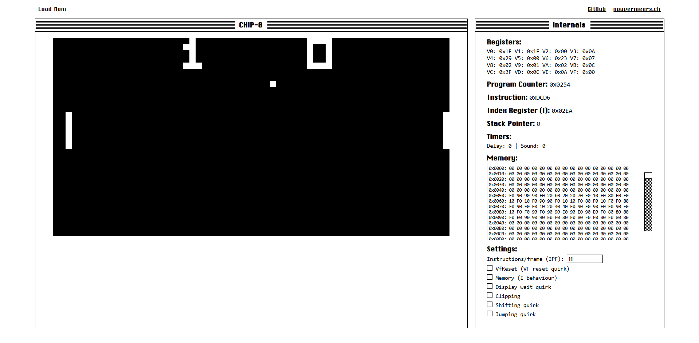

# CHIP-8 Emulator

This CHIP-8 emulator was built using JavaScript. As my technical references I primarily used *COSMAC VIP Manual (CDP18S711), Ch. III: "CHIP-8 Language Programming* and *"An Easy Programming System" Byte Magazine, Vol. 3, No. 12*. I also used Timendus' test suite.

